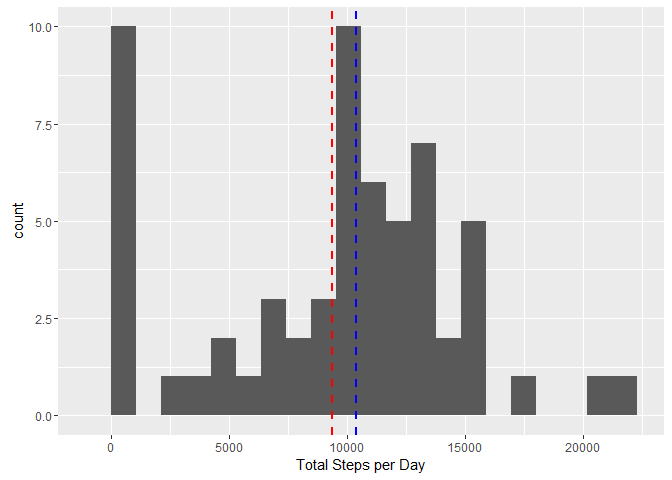
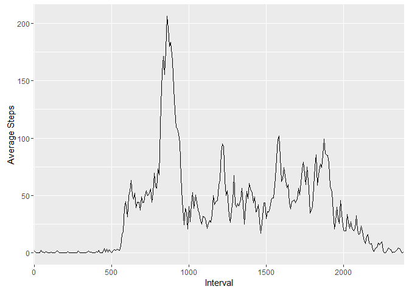
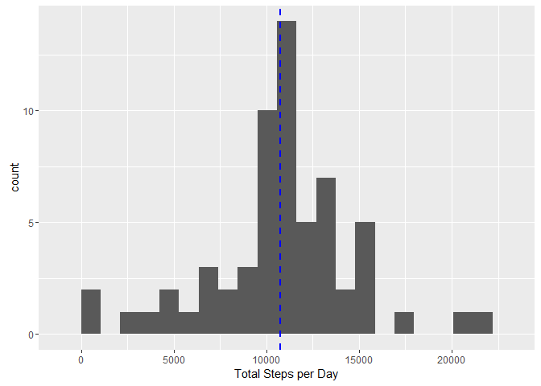
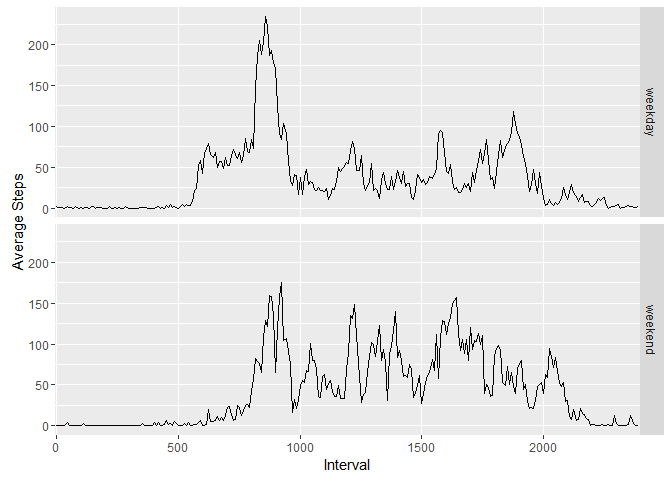

# Reproducible Research: Peer Assessment 1


## Loading and preprocessing the data
### Load and Verify
The first step is to download the csv file in the working directory. Once you have the file in the working directory, run the below command to load the file in a data frame.

```r
df <- read.csv("activity.csv")
```
Next we would do some quick validation that the data is loaded successfully by running a few summary commands.

```r
str(df)
```

```
## 'data.frame':	17568 obs. of  3 variables:
##  $ steps   : int  NA NA NA NA NA NA NA NA NA NA ...
##  $ date    : Factor w/ 61 levels "2012-10-01","2012-10-02",..: 1 1 1 1 1 1 1 1 1 1 ...
##  $ interval: int  0 5 10 15 20 25 30 35 40 45 ...
```

### Prepare data for Analysis
* First convert date to date format

```r
df <- transform(df,date=as.Date(date,"%Y-%m-%d"))
```
Verify the conversion was successful by running the below command.

```r
class(df$date)
```

```
## [1] "Date"
```
Change the intervals to factors for future analysis.

```r
df <- transform(df,interval=factor(interval))
```
Verify the conversion was successful by running the below command.

```r
class(df$interval)
```

```
## [1] "factor"
```

* Create summary data frames for analysis of steps data by date and by interval
First create a new data frame with steps summary data. Also change all NA values to zero for the first pass.

```r
steps.by.day <- aggregate(steps~date,df,sum,na.action=NULL)
steps.by.day[is.na(steps.by.day)] <- 0
```
Verify the new data frame by looking at the summary using the below command.

```r
str(steps.by.day)
```

```
## 'data.frame':	61 obs. of  2 variables:
##  $ date : Date, format: "2012-10-01" "2012-10-02" ...
##  $ steps: num  0 126 11352 12116 13294 ...
```

Similar to date, build a new data frame with interval information.

```r
steps.by.interval <- aggregate(steps~interval,df,mean,na.action = na.omit)
steps.by.interval[is.na(steps.by.interval)] <- 0
```
Verify the output.

```r
str(steps.by.interval)
```

```
## 'data.frame':	288 obs. of  2 variables:
##  $ interval: Factor w/ 288 levels "0","5","10","15",..: 1 2 3 4 5 6 7 8 9 10 ...
##  $ steps   : num  1.717 0.3396 0.1321 0.1509 0.0755 ...
```

```r
head(steps.by.interval)
```

```
##   interval     steps
## 1        0 1.7169811
## 2        5 0.3396226
## 3       10 0.1320755
## 4       15 0.1509434
## 5       20 0.0754717
## 6       25 2.0943396
```


## What is mean total number of steps taken per day?
In this section, we will use the steps.by.day data frame to compute the mean & median and create the histogram. We will use ggplot2 for the creation of histogram.

The first step is to load the ggplot2 package.

```r
library(ggplot2)
```

```
## Warning: package 'ggplot2' was built under R version 3.2.3
```

Before we draw the graph, we will compute the mean and median for the steps per day.

```r
steps.by.day.mean <- mean(steps.by.day$steps,na.rm = TRUE)
print(steps.by.day.mean)
```

```
## [1] 9354.23
```

```r
steps.by.day.median <- median(steps.by.day$steps,na.rm = TRUE)
print(steps.by.day.median)
```

```
## [1] 10395
```

Now we will create the simple histogram using the steps data for day prepared in prior step. We will also add vertical lines to the histogram to show the mean and median for the distribution.

```r
qplot(steps,data = steps.by.day, bins = 20) + xlab("Total Steps per Day") + geom_vline(aes(xintercept=steps.by.day.mean), color = "red", linetype = "dashed", size = 1) + geom_vline(aes(xintercept = steps.by.day.median), color = "blue", linetype = "dashed", size = 1)
```

 


## What is the average daily activity pattern?
In this section, we are going to review the activity during various interval across all the days.We will do this by creating a time series plot for steps using the below command.

```r
str(steps.by.interval)
```

```
## 'data.frame':	288 obs. of  2 variables:
##  $ interval: Factor w/ 288 levels "0","5","10","15",..: 1 2 3 4 5 6 7 8 9 10 ...
##  $ steps   : num  1.717 0.3396 0.1321 0.1509 0.0755 ...
```

```r
ggplot(data = steps.by.interval,aes(x=interval, y=steps, group = 1)) + geom_line() + xlab("Interval") + ylab("Average Steps") + scale_x_discrete(breaks=c(0,500,1000,1500,2000,2500,3000))
```

 

Next we will try to find the interval with with maximum number of steps.

```r
steps.by.interval.max <- steps.by.interval[which.max(steps.by.interval$steps),]
print(steps.by.interval.max)
```

```
##     interval    steps
## 104      835 206.1698
```


## Inputing missing values
In this section, we will first review the main data frame for missing values "NA".

```r
sum(is.na(df$steps))
```

```
## [1] 2304
```

Simplest substituation, replacing all NAs with 0.

```r
rev1.df <- df
rev1.df[is.na(rev1.df$steps),"steps"] <- 0
```

Now lets try to regenerate the graphs as done in above section.

```r
steps.by.day1 <- aggregate(steps~date,rev1.df,sum,na.action=NULL)
steps.by.day1[is.na(steps.by.day)] <- 0

steps.by.day.mean1 <- mean(steps.by.day1$steps,na.rm = TRUE)
print(steps.by.day.mean1)
```

```
## [1] 9354.23
```

```r
steps.by.day.median1 <- median(steps.by.day1$steps,na.rm = TRUE)
print(steps.by.day.median1)
```

```
## [1] 10395
```

```r
qplot(steps,data = steps.by.day1, bins = 20) + xlab("Total Steps per Day") + geom_vline(aes(xintercept=steps.by.day.mean1), color = "red", linetype = "dashed", size = 1) + geom_vline(aes(xintercept = steps.by.day.median1), color = "blue", linetype = "dashed", size = 1)
```

 

The above strategy yields identical results, so now we will try to replace the NAs with the mean value.

```r
ReplaceNA <- function(steps,interval){
  replace <- NA
    if (!is.na(steps)) 
        replace <- c(steps) else replace <- (steps.by.interval[steps.by.interval$interval == interval, "steps"])
    return(replace)
} 

Rev2.df <- df
Rev2.df$steps <- mapply(ReplaceNA, Rev2.df$steps, Rev2.df$interval)
```

Now we will use this new data frame to regenerate the graphs.

```r
steps.by.day2 <- aggregate(steps~date,Rev2.df,sum,na.action=NULL)
steps.by.day2[is.na(steps.by.day)] <- 0

steps.by.day.mean2 <- mean(steps.by.day2$steps,na.rm = TRUE)
print(steps.by.day.mean2)
```

```
## [1] 10766.19
```

```r
steps.by.day.median2 <- median(steps.by.day2$steps,na.rm = TRUE)
print(steps.by.day.median2)
```

```
## [1] 10766.19
```

```r
qplot(steps,data = steps.by.day2, bins = 20) + xlab("Total Steps per Day") + geom_vline(aes(xintercept=steps.by.day.mean2), color = "red", linetype = "dashed", size = 1) + geom_vline(aes(xintercept = steps.by.day.median2), color = "blue", linetype = "dashed", size = 1)
```

 


## Are there differences in activity patterns between weekdays and weekends?
Add a new column to the main data frame to identify the day of the week.

```r
extra.df<-cbind(df,weekdays(df$date))
head(extra.df)
```

```
##   steps       date interval weekdays(df$date)
## 1    NA 2012-10-01        0            Monday
## 2    NA 2012-10-01        5            Monday
## 3    NA 2012-10-01       10            Monday
## 4    NA 2012-10-01       15            Monday
## 5    NA 2012-10-01       20            Monday
## 6    NA 2012-10-01       25            Monday
```

Using the day of the week find create a new factor for "Weekday" and "Weekend" using if command.

```r
weekday.or.weekend <- function(day) {
    if (day %in% c("Saturday", "Sunday")) 
        return("weekend") else return("weekday")
}

extra.df$day <- sapply(extra.df$`weekdays(df$date)`, FUN = weekday.or.weekend)

head(extra.df)
```

```
##   steps       date interval weekdays(df$date)     day
## 1    NA 2012-10-01        0            Monday weekday
## 2    NA 2012-10-01        5            Monday weekday
## 3    NA 2012-10-01       10            Monday weekday
## 4    NA 2012-10-01       15            Monday weekday
## 5    NA 2012-10-01       20            Monday weekday
## 6    NA 2012-10-01       25            Monday weekday
```

```r
extra.df <- transform(extra.df,day = factor(day))
```
Now we can compare the weekdays and weekends.

```r
steps.by.day2 <- aggregate(steps ~ interval + day, data = extra.df, mean)
ggplot(data = steps.by.day2,aes(x=interval, y=steps, group = 1)) + geom_line() + facet_grid(day ~ .) + xlab("Interval") + ylab("Average Steps") + scale_x_discrete(breaks=c(0,500,1000,1500,2000,2500,3000))
```

 

